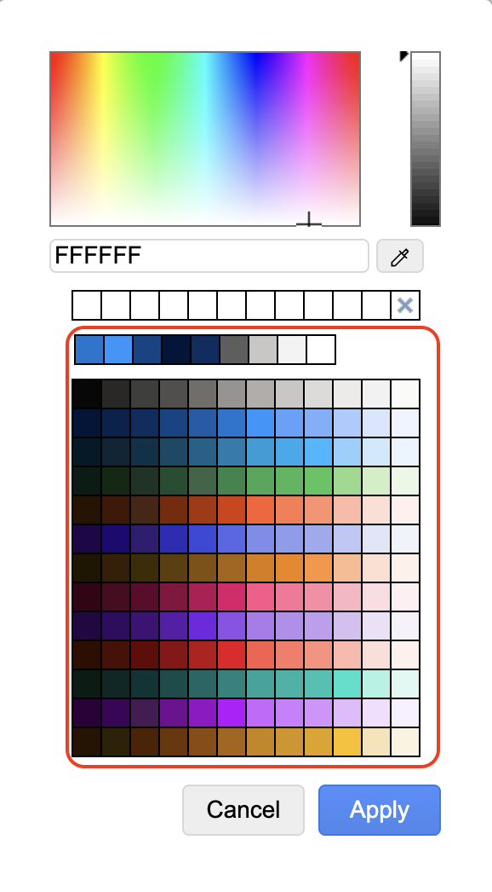
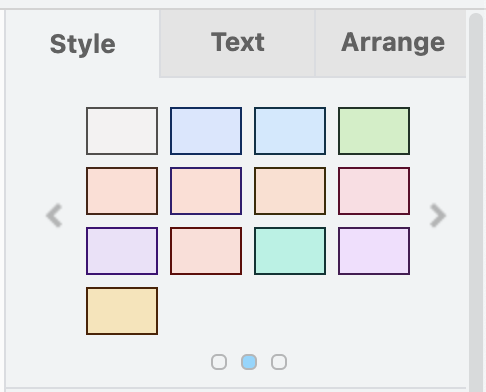
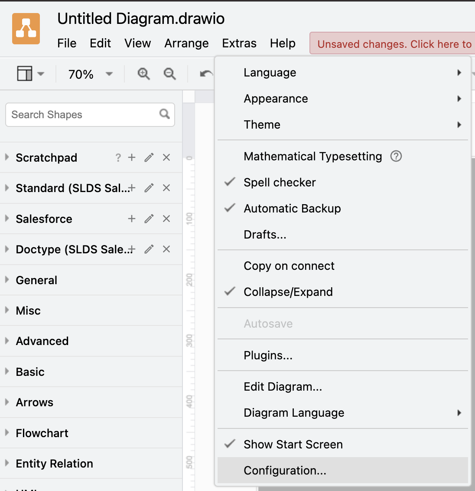

# Unofficial draw.io ibrary for Salesforce

This library is a collection of DrawIo shapes for Salesforce. It is based on the [Salesforce Diagramming Framework](https://architect.salesforce.com/diagrams)

## Features

### Icon Library

The library contains icons and logos for Salesforce products. You can use them in your diagrams by selecting the shape and then clicking on the icon in the icon library. The library contains the following categories:

- Industry Icons
- Platform Icons
- Product Icons
- Product Logos

### Color Palette

The library contains the [Salesforce color palette](https://www.lightningdesignsystem.com/design-tokens/#category-color). You can use the colors in your diagrams by selecting the shape and then clicking on the color in the color palette.

## Predefined Styles

The library contains predefined styles for the shapes. You can use them by selecting the shape and then clicking on the style in the style palette. The styles are based on Salesforce [Design Tokens](https://www.lightningdesignsystem.com/design-tokens/#category-color).

## Setup

Copy the raw content of the [configuration.json](/configuration.json) file and open your Draw.Io application. Then got to `Extras > Configuration...` and paste the content of the file into the text field. Click on `Apply` and you are done.

